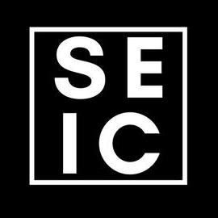

# SEIC - SMVDU Entrepreneurship & Innovation Club 🚀✨

     
**ABOUT** : 
_SEIC aims to help university memebers experiment, collaborate, initiate and implement ideas & plans. Meet and share ideas. Take risks, face challenges and commit to their dreams. To fund their dream project. Innovate in their fields. Meet established innovators & entrepreneurs. And to build and network with a great community of doers._

## SEIC helps you

Find and meet like-minded, knowledgeful, motivated individuals, potentially willing to join your project.

Present your ideas / creations to a wider audience and test it with a support group.

Fund your project if it requires specialized equiment not available locally or not affordale to you.

## Recommended interest fields
If you consider yourself or your idea among any of the mentioned fields, we recommend you part-take in the club activities:
+ *Music*
+ *Design*
+ *Architecture*
+ *Photography*
+ *Dance*
+ *Drama*
+ *Technology*
+ *Engineering*
+ *Mathematics*
+ *Science*
+ *Philosophy*
+ *Creative Writing*
+ *(Plausible field we forgot mentioning)*

SEIC is all about **STEM** (Science, Technology, Engineering & Mathematics) and **TED** (Technology, Entertainment & Design). The club can help you convert your ideas into reality, to innovate. It can't help you learn these fields. We consider you will pitch in your ideas / plans only when you're confident you have atleast half the knowledge that back those ideas.

## Goals ⚽🥅
1. Encourage and develop ideas into reality / products.
2. Promote and nourish an active makers' community.
3. Help members realize individual and group potential.
4. Aid in networking and exposing great products and ideas. 

---
(Portion under construction) Head over to the [**Issues**](https://github.com/Entrepreneurship-and-Innovation-Club/SEIC/issues) section to contribute ideas, and have contructive discussions on the same. We will also be listing some [**Projects**](https://github.com/Entrepreneurship-and-Innovation-Club/SEIC/projects) soon, once the wheels are set in motion. _**Stay active. Keep participating. Both positive and negative inputs welcome, given they are both contructive. Don't just critique, suggest solutions. Cheers!**

---

## We don't promise 🏳️
The things we don't promise you:
+ Your active participation.
+ 100% satisfaction
+ Doorstep results delivery
